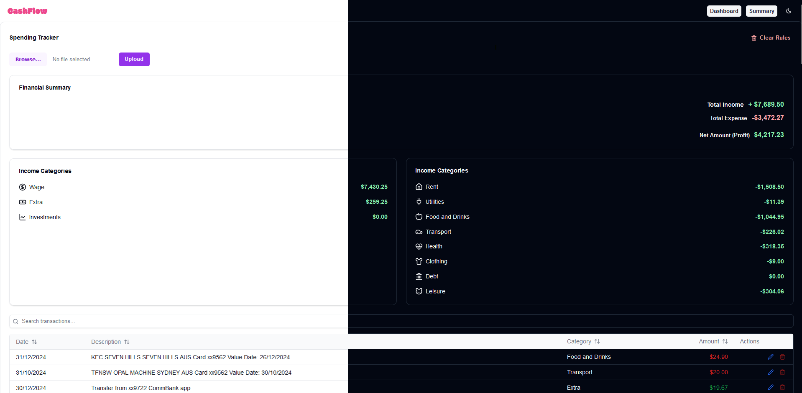

# Cashflow

Cash is a modern expense tracking tool that helps you understand and optimise your spendings. Upload your transactions and get instant insights into your spending patterns, and make informated financial decisions.



## Table of Contents

- [Installation](#installation)
- [Usage](#usage)

## 🚀 Getting Started

Prerequisites
Before you begin, ensure you have the following installed:

[](https://www.npmjs.com/)
[](https://nodejs.org/)

## Installation

1. Clone the repo:

```bash
  git clone git@github.com:ramkaucha/cashflow.git
  cd cashflow
```

2. Install dependences:

```bash
  npm install
```

## Usage

To run the project, use the following command:

```bash
npm run dev
```

## 🛠️ Tech Stack

[](https://nextjs.org/)
[](https://reactjs.org/)
[](https://www.typescriptlang.org/)
[](https://tailwindcss.com/)
